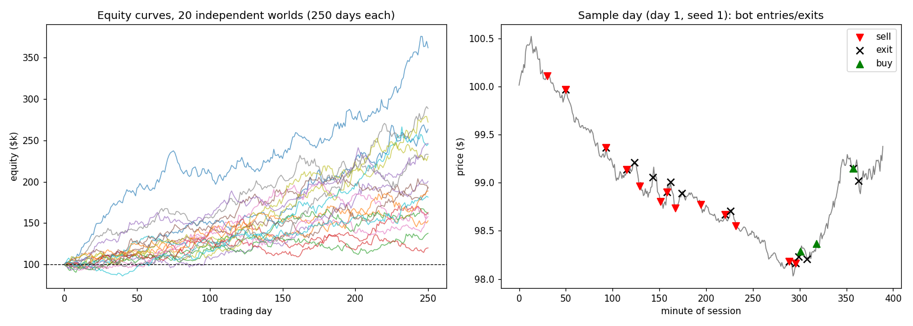
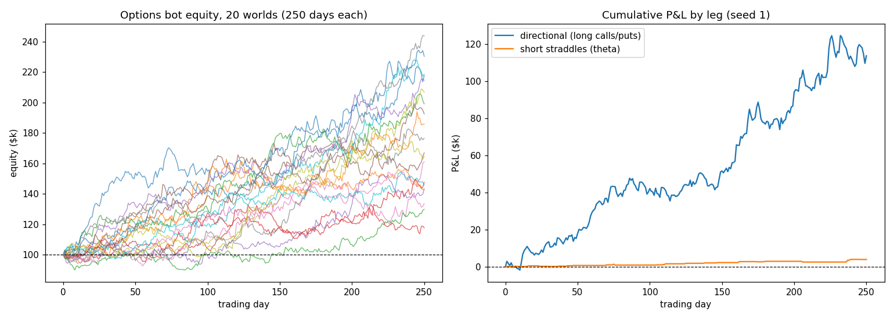
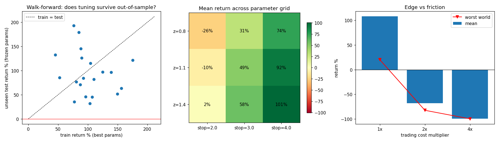

# Day Trading Simulator (paper money only)

A self-contained experiment answering the question: *can a bot day trade
with a positive outcome?* — honestly, with baselines, and without
cherry-picking.

## What it does

`sim.py` builds a synthetic intraday market with realistic structure:

- 390 one-minute bars per session (9:30–16:00), overnight gaps
- regime-switching drift (chop / uptrend / downtrend) — genuine but weak
  intraday momentum, ~0.9bp/min drift vs ~5bp/min noise
- volatility clustering plus the intraday U-shape (busy open/close)
- occasional news jumps
- trading costs on every fill: half-spread, commission, slippage
  (~1.5bp per side)

A momentum bot trades it: EMA(6/24) crossover scaled by realized vol,
entries only when trend strength clears a threshold, 1%-of-equity risk
per trade, vol-scaled trailing stops, max 2x leverage, no entries in the
last 30 minutes, always flat by the close.

## Keeping it honest

- **20 independent seeded worlds × 250 trading days each** — the full
  distribution is reported, not a lucky run.
- **Buy & hold baseline** on the same price paths.
- **Coin-flip baseline**: identical entry timing, sizing, stops and
  exits, but the trade *direction* is random. The gap between the bot
  and this baseline is exactly the value of the signal.

## Results

| | mean return | median | worst world | profitable worlds |
|---|---|---|---|---|
| Momentum bot | +107.6% | +92.9% | +20.0% | 20/20 |
| Buy & hold | +7.2% | +5.3% | −33.7% | 12/20 |
| Coin-flip trader | −63.2% | −67.6% | −79.8% | 0/20 |

Sharpe 0.6–3.9 across worlds, max drawdown −9% to −26%, ~4,700 trades
per world, ~35% win rate (classic trend-following: many small losses,
fewer large wins).



## v2: Options layer (`options_sim.py`)

Adds a Black-Scholes pricer (r=0), a synthetic IV surface that tracks
the market's volatility state with a mild put skew and a ~15% variance
risk premium (implied quoted above realized, as in real index options),
and option spreads on every fill. The bot maps regimes to instruments:

- **trend** (strong momentum signal): buy ~5-day ATM calls/puts;
  exit on signal flip, −40% premium stop, or the close.
- **chop** (quiet signal **and** rich implied vol): sell a same-day ATM
  straddle, **delta-hedged with shares** inside a 25% band, disaster
  stop at 2x credit, flat by the close.

| (20 worlds × 250 days) | mean return | worst world | profitable worlds |
|---|---|---|---|
| Options bot | +77.0% | +17.7% | 20/20 |
| Shares bot (v1, same paths) | +107.6% | +20.0% | 20/20 |
| Coin-flip direction options | −59.1% | −75.9% | 0/20 |

Both legs are independently positive in all 20 worlds. Lessons that
mirror reality: a naive unhedged short straddle *lost* money in 18/20
worlds until it was delta-hedged and filtered to sell only rich vol;
and options underperform shares for pure direction because spreads and
theta tax every trade.



## v3: Data-driven validation (`validate.py`)

The tests a desk would run before believing any of the above:

1. **Walk-forward optimization** — grid-search (entry threshold × stop
   width) on days 1–125 of each world, then trade the *frozen* best
   parameters on the unseen days 126–250. Result: train +102% → test
   +94% mean; tuned beats default in 20/20 worlds out-of-sample.
2. **Statistical significance** — per-world t-stats on daily returns:
   significant at the 5% level in 17/20 worlds; pooled mean daily
   return +0.53% with a 95% bootstrap CI of [+0.46%, +0.60%].
3. **Parameter robustness** — the return surface over the grid is a
   smooth plateau (profit rises gradually with selectivity and stop
   width), not a single hot cell. Tight stops (2x vol) get whipsawed
   to losses; wide stops let the trend breathe.
4. **Cost stress** — the punchline: at 1x costs the bot makes +108%;
   at 2x costs (just 3bp/side) it *loses* 68%; at 4x it is wiped out.
   The entire edge lives inside a thin cost envelope — exactly how
   real intraday edges behave, and why retail day trading mostly
   doesn't work.



## The honest caveat

The bot wins because the simulated market contains real (if weak)
momentum, and the bot extracts it efficiently net of costs while the
coin-flip trader is ground to dust by the same costs. Real markets have
weaker, non-stationary, heavily-competed versions of these patterns —
this is a demonstration of disciplined strategy mechanics, not evidence
that day trading real money is a good idea. (It usually isn't.)

## Run it

```
pip install numpy matplotlib
python3 sim.py           # v1: shares bot + baselines
python3 options_sim.py   # v2: options bot vs shares bot
python3 validate.py      # v3: walk-forward, significance, robustness, cost stress
```
